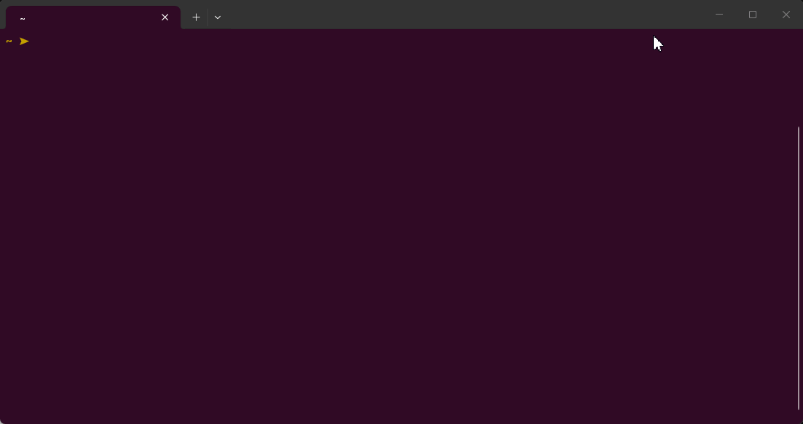

# asdf-tui

A fast, flicker-free, column-style TUI (Go + [bubbletea](https://github.com/charmbracelet/bubbletea))
for discovering, installing, updating and removing tools managed by
[asdf](https://asdf-vm.com).

Type to search the catalog **fzf-style** (live match on name, project link,
description and project description, ranked — name matches surface first), then
cascade through **three columns**: tools → actions → versions.

<p align="center">
  
</p>

## Installation

The easiest way — one command, no manual steps, the script detects your OS
and CPU, downloads the matching prebuilt binary from the latest GitHub
Release to your `/usr/local/bin`, and verifies it runs:

```bash
bash <(curl -sfL https://raw.githubusercontent.com/BrunIF/asdf-tui/main/install.sh)
```

That works on **Linux and macOS** (x86-64/amd64 and arm64, plus 32-bit x86 on
Linux). The tool goes to `/usr/local/bin/asdf-tui`, so `sudo` will be prompted
only when that directory is not writable by your user.

If you prefer to see everything explicitly (or curl is unavailable), install
by hand:

```bash
# 1) find the latest version and the binary name for your machine
AR=amd64                        # arm64 on ARM machines, 386 on 32-bit Linux
BIN=asdf-tui-<VERSION>-$(uname -s | tr 'A-Z' 'a-z')-$AR
#    e.g. asdf-tui-1.2.4-linux-amd64, asdf-tui-1.2.4-darwin-arm64

# 2) download it from the release into /usr/local/bin
curl -sfL -o /tmp/$BIN \
  https://github.com/BrunIF/asdf-tui/releases/download/v<VERSION>/$BIN
chmod +x /tmp/$BIN
sudo install -m 0755 /tmp/$BIN /usr/local/bin/asdf-tui
rm /tmp/$BIN

# 3) confirm it is alive
asdf-tui version
```

## Documentation

- [Usage and reference](docs/usage.md) — requirements, every command, the full
  TUI key map and column reference, repo layout, roadmap.
